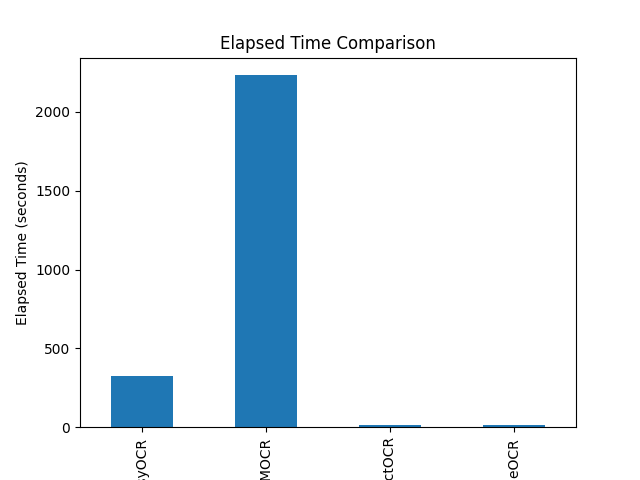
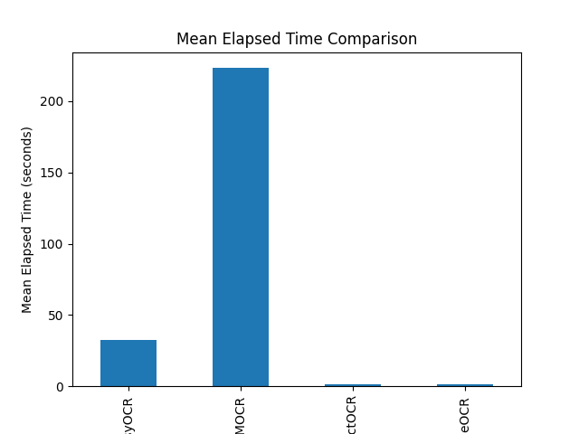
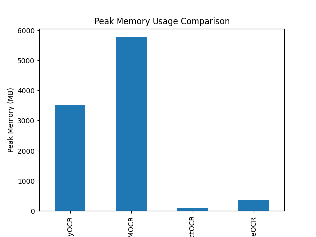
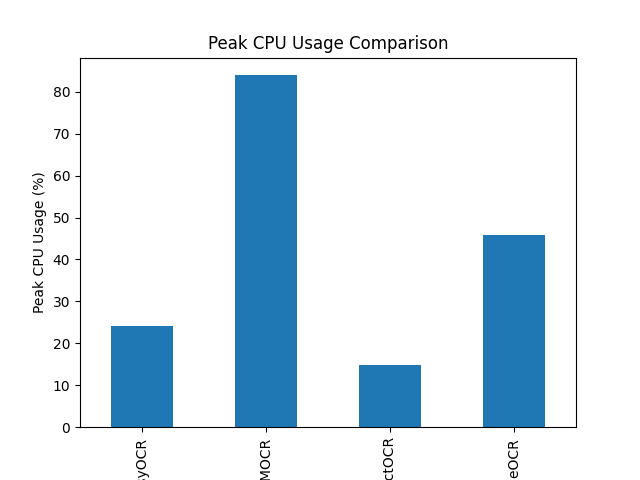
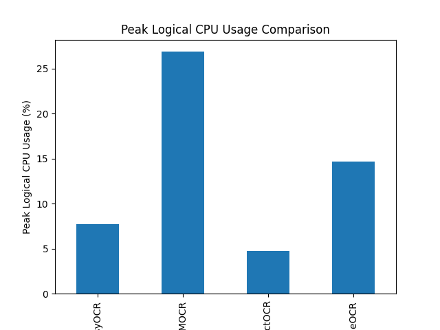

# OCR Hardware benchmark
This benchmark aims at quantifying the hardware performance of OCR models on CPU.

## Results

| Index | Elapsed Time (s) | Mean Elapsed Time (s/doc) | Peak CPU (%) | Peak Logical CPU (n_cpu) | Peak Memory (MB) | Engine         |
|-------|-------------------|-----------------------|--------------|-----------------------|------------------|----------------|
| 0     | 323.271           | 32.327               | 24.25        | 7.760                 | 3513.83          | EasyOCR        |
| 1     | 2233.406          | 223.341              | 83.95        | 26.864                | 5769.37          | MMOCR          |
| 2     | 12.984            | 1.298                | 14.85        | 4.752                 | 100.30           | TesseractOCR   |
| 3     | 12.993            | 1.299                | 45.90        | 14.688                | 347.27           | PaddleOCR      |

## Plots

